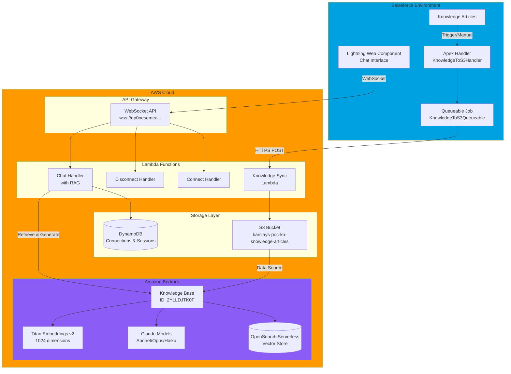
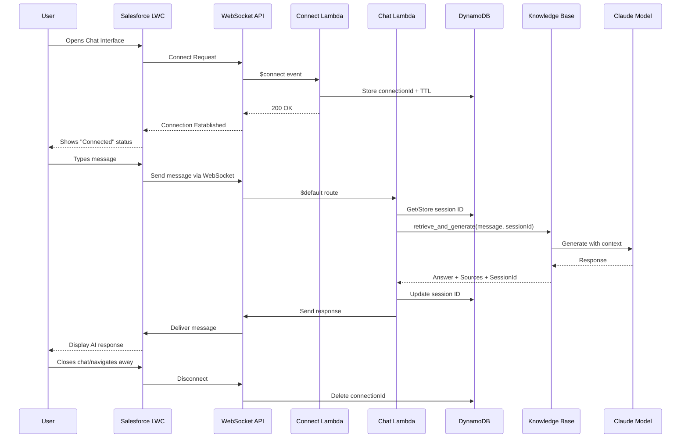
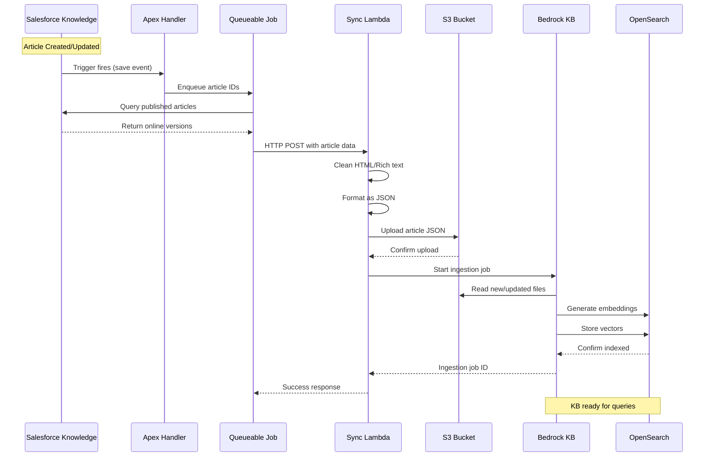
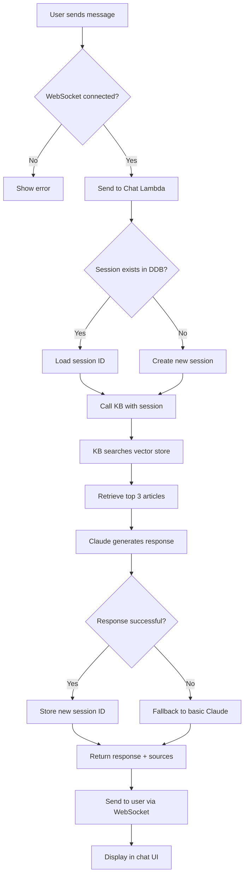
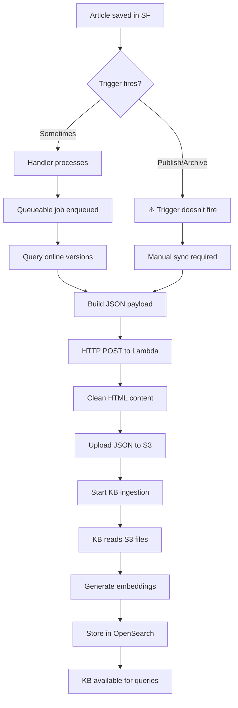

# Salesforce AI Chat with AWS Bedrock RAG - Knowledge Transfer Document

## Table of Contents
1. [Overview](#overview)
2. [Architecture](#architecture)
3. [Components](#components)
4. [Data Flow](#data-flow)
5. [Setup & Configuration](#setup--configuration)
6. [Known Issues & Workarounds](#known-issues--workarounds)
7. [Troubleshooting](#troubleshooting)
8. [Future Enhancements](#future-enhancements)

---

## Overview

This application provides an AI-powered chat interface embedded in Salesforce that leverages AWS Bedrock's Claude models with Retrieval-Augmented Generation (RAG). The system enables real-time conversational AI that answers questions based on Salesforce Knowledge Articles, providing contextually relevant responses with source citations.

### Key Features
- **Real-time Chat**: WebSocket-based communication for instant responses
- **RAG-Enhanced AI**: Answers grounded in Salesforce Knowledge Articles
- **Session Persistence**: Maintains conversation context across multiple messages
- **Source Citations**: References specific knowledge articles used in responses
- **Multi-Model Support**: Configurable Claude models (Sonnet, Opus, Haiku)
- **Automatic Knowledge Sync**: Salesforce articles automatically synced to AWS

### Technology Stack
- **Frontend**: Salesforce Lightning Web Component (LWC)
- **Backend**: AWS Lambda (Python 3.11)
- **AI/ML**: Amazon Bedrock (Claude models)
- **Vector Store**: Amazon OpenSearch Serverless
- **Real-time Communication**: AWS API Gateway WebSocket
- **Storage**: Amazon S3, DynamoDB
- **Embeddings**: Amazon Titan Text Embeddings v2

---

## Architecture

### High-Level Architecture



### WebSocket Communication Flow



### Knowledge Article Sync Flow



---

## Components

### 1. Salesforce Components

#### Lightning Web Component (LWC)
**File**: `aiChatInterface.js`, `aiChatInterface.html`, `aiChatInterface.css`

**Purpose**: Provides the user interface for the chat experience

**Key Features**:
- WebSocket connection management
- Real-time message display
- Typing indicators
- Error handling
- Auto-resizing input
- Message history display
- Source citation display

**Configuration**:
```javascript
wsUrl = 'wss://op0nesemea.execute-api.us-west-2.amazonaws.com/dev';
```

**Available in**:
- App Pages
- Home Pages
- Record Pages
- Tabs
- Utility Bar
- Communities

#### Apex Handler
**File**: `KnowledgeToS3Handler.cls`

**Purpose**: Processes Knowledge Articles and sends them to AWS Lambda

**Key Methods**:
- `processArticles(List<Id>)`: Future method for async processing
- `buildArticleJson()`: Formats article data as JSON
- `sendToLambda()`: Makes HTTP callout to Lambda
- `logError()`: Error tracking

**Named Credential**: `AWS_Lambda_S3_Sync`

#### Queueable Job
**File**: `KnowledgeToS3Queueable.cls`

**Purpose**: Handles batch processing of knowledge articles

**Why Queueable?**:
- Allows callouts (HTTP to Lambda)
- Better for governor limit management
- Can be chained for large batches
- More reliable than future methods for batch operations

### 2. AWS Lambda Functions

#### Connect Handler
**CloudFormation Resource**: `ConnectFunction`

**Purpose**: Handles WebSocket connection establishment

**Actions**:
- Stores connection ID in DynamoDB
- Sets TTL (2 hours) for auto-cleanup
- Returns success/failure status

#### Disconnect Handler
**CloudFormation Resource**: `DisconnectFunction`

**Purpose**: Cleans up closed connections

**Actions**:
- Removes connection ID from DynamoDB
- Logs disconnection event

#### Chat Handler (RAG-Enabled)
**CloudFormation Resource**: `DefaultFunction`

**File**: Updated Lambda code provided

**Purpose**: Main chat processing with RAG capabilities

**Key Functions**:
- `lambda_handler()`: Main entry point
- `get_bedrock_session_id()`: Retrieves existing session
- `store_bedrock_session_id()`: Persists session ID
- `call_bedrock_rag_with_session()`: RAG query with context
- `call_fallback_bedrock()`: Fallback without KB

**Environment Variables**:
```python
TABLE_NAME: websocket-connections-dev
BEDROCK_MODEL_ID: anthropic.claude-3-5-sonnet-20241022-v2:0
KNOWLEDGE_BASE_ID: 2YLLDJTK0F
```

**RAG Configuration**:
- Number of results: 3 (top 3 most relevant articles)
- Session-based conversation context
- Automatic fallback if KB unavailable

#### Knowledge Sync Lambda
**CloudFormation Resource**: `SalesforceKnowledgeSyncFunction`

**Purpose**: Receives articles from Salesforce and syncs to S3

**Key Functions**:
- `process_article()`: Cleans and structures data
- `clean_rich_text()`: HTML to markdown conversion
- `upload_to_s3()`: Stores JSON in S3
- `sync_knowledge_base()`: Triggers KB ingestion

**Lambda Function URL**: Public endpoint for Salesforce callouts

### 3. AWS Infrastructure

#### DynamoDB Table
**Name**: `websocket-connections-dev`

**Schema**:
```
Primary Key: connectionId (String)
GSI: userId-index (for future user tracking)
Attributes:
  - connectionId
  - userId (optional)
  - connectedAt (timestamp)
  - bedrockSessionId (for conversation context)
  - ttl (auto-deletion after 2 hours)
```

#### S3 Bucket
**Name**: `barclays-poc-kb-knowledge-articles`

**Structure**:
```
s3://barclays-poc-kb-knowledge-articles/
  ├── kb-<ArticleNumber>.json
  ├── kb-<ArticleNumber>.json
  └── ...
```

**File Format**:
```json
{
  "id": "kb-000001",
  "title": "Article Title",
  "topic": "Knowledge Base",
  "category": "Customer Support",
  "content": "Cleaned article content...",
  "metadata": {
    "author": "John Doe",
    "last_updated": "2025-09-03",
    "region": "US",
    "importance": "Medium",
    "source": "Salesforce Knowledge"
  },
  "related_articles": []
}
```

#### Bedrock Knowledge Base
**Name**: `salesforce-knowledge-base`
**ID**: `2YLLDJTK0F`

**Configuration**:
- **Vector Store**: Amazon OpenSearch Serverless
- **Collection ARN**: `arn:aws:aoss:us-west-2:918888467489:collection/kiepfh7248ge6dzmbz39`
- **Embeddings Model**: Titan Text Embeddings v2
- **Embedding Type**: Float vector embeddings
- **Vector Dimensions**: 1024
- **Chunking Strategy**: Default
- **Parsing Strategy**: Default

**Vector Store Indexes**:
- Vector Index: `bedrock-knowledge-base-default-index`
- Vector Field: `bedrock-knowledge-base-default-vector`
- Text Field: `AMAZON_BEDROCK_TEXT`
- Metadata Field: `AMAZON_BEDROCK_METADATA`

**Data Source**:
- Type: S3
- Bucket: `s3://barclays-poc-kb-knowledge-articles`
- Status: Available
- Data Deletion Policy: Delete

---

## Data Flow

### User Query Processing



### Knowledge Article Ingestion



---

## Setup & Configuration

### Prerequisites
- AWS Account with Bedrock access
- Salesforce org with Knowledge enabled
- AWS CLI configured
- Salesforce CLI (optional, for deployment)
- System Administrator access in Salesforce

### Required Salesforce Permissions
- **Setup Access**: Required for configuration
- **CSP Trusted Sites**: Required for WebSocket connections
- **Remote Site Settings**: Required for Lambda callouts
- **Named Credentials**: Required for secure API connections

### Step 1: Deploy AWS Infrastructure

```bash
# Deploy WebSocket Chat API
aws cloudformation create-stack \
  --stack-name salesforce-chat-websocket \
  --template-body file://websocket-chat-template.yaml \
  --parameters \
    ParameterKey=Environment,ParameterValue=dev \
    ParameterKey=BedrockModelId,ParameterValue=anthropic.claude-3-5-sonnet-20241022-v2:0 \
  --capabilities CAPABILITY_NAMED_IAM

# Deploy Knowledge Sync Lambda
aws cloudformation create-stack \
  --stack-name salesforce-knowledge-sync \
  --template-body file://knowledge-sync-template.yaml \
  --parameters \
    ParameterKey=Environment,ParameterValue=dev \
    ParameterKey=S3BucketName,ParameterValue=barclays-poc-kb-knowledge-articles \
    ParameterKey=KnowledgeBaseId,ParameterValue=2YLLDJTK0F \
    ParameterKey=DataSourceId,ParameterValue=<YOUR_DATA_SOURCE_ID> \
  --capabilities CAPABILITY_NAMED_IAM
```

### Step 2: Create S3 Bucket

```bash
aws s3 mb s3://barclays-poc-kb-knowledge-articles --region us-west-2
```

### Step 3: Configure Bedrock Knowledge Base

#### Create Knowledge Base
1. Navigate to Amazon Bedrock Console → Knowledge Bases
2. Click "Create Knowledge Base"
3. **Settings**:
   - Name: `salesforce-knowledge-base`
   - IAM Role: Create new role (AmazonBedrockExecutionRoleForKnowledgeBase)

#### Configure Data Source
4. **Data Source**:
   - Type: S3
   - Bucket: `s3://barclays-poc-kb-knowledge-articles`
   - Chunking: Default
   - Parsing: Default

#### Configure Embeddings & Vector Store
5. **Embeddings**:
   - Model: Titan Text Embeddings v2
   - Dimensions: 1024
   
6. **Vector Store**:
   - Type: Amazon OpenSearch Serverless
   - Create new collection or select existing
   - Note the Collection ARN

7. Click "Create Knowledge Base"
8. **Important**: Copy the Knowledge Base ID (e.g., `2YLLDJTK0F`)

#### Get Data Source ID
```bash
aws bedrock-agent list-data-sources \
  --knowledge-base-id 2YLLDJTK0F \
  --region us-west-2
```

### Step 4: Update Lambda Environment Variables

```bash
# Update Chat Lambda with KB ID
aws lambda update-function-configuration \
  --function-name websocket-bedrock-chat-dev \
  --environment Variables="{
    TABLE_NAME=websocket-connections-dev,
    BEDROCK_MODEL_ID=anthropic.claude-3-5-sonnet-20241022-v2:0,
    KNOWLEDGE_BASE_ID=2YLLDJTK0F
  }"
```

### Step 5: Configure Salesforce

#### Deploy LWC Component
```bash
# Using Salesforce CLI
sfdx force:source:deploy -p force-app/main/default/lwc/aiChatInterface
```

#### Create Named Credential
1. Setup → Named Credentials → New Named Credential
2. **Settings**:
   - Label: `AWS_Lambda_S3_Sync`
   - Name: `AWS_Lambda_S3_Sync`
   - URL: `<Lambda Function URL from CloudFormation outputs>`
   - Identity Type: Named Principal
   - Authentication Protocol: Password (or Anonymous if no auth)
   - Generate Authorization Header: Yes

#### Update LWC with WebSocket URL
In `aiChatInterface.js`, update:
```javascript
wsUrl = 'wss://<YOUR_API_ID>.execute-api.us-west-2.amazonaws.com/dev';
```

#### Deploy Apex Classes
```bash
sfdx force:source:deploy -p force-app/main/default/classes/KnowledgeToS3Handler.cls
sfdx force:source:deploy -p force-app/main/default/classes/KnowledgeToS3Queueable.cls
```

#### Add Remote Site Settings
Setup → Remote Site Settings → New
- Name: `AWS_Lambda`
- URL: `https://<lambda-function-url>`

#### Configure Trusted URL for WebSocket
**Critical**: WebSocket connections require Trusted URL configuration in Salesforce

1. Setup → Security → CSP Trusted Sites → New Trusted Site
2. **Settings**:
   - **Trusted Site Name**: `AWS_WebSocket`
   - **Trusted Site URL**: `https://op0nesemea.execute-api.us-west-2.amazonaws.com`
   - **Description**: WebSocket connection for AI Chat
   - **Active**: ✅ Checked

3. **CSP Context**: Select `All`

4. **CSP Directives** (Enable the following):
   - ✅ `connect-src` (scripts) - **REQUIRED for WebSocket**
   - ✅ `font-src` (fonts)
   - ✅ `frame-src` (iframe content)
   - ✅ `img-src` (images)
   - ✅ `media-src` (audio and video)
   - ✅ `style-src` (stylesheets)

5. **Permissions Policy Directives** (Optional):
   - `camera` - Enable if adding video chat
   - `microphone` - Enable if adding voice input

**⚠️ Important Notes**:
- The URL must be HTTPS (WebSocket uses WSS)
- Must include full domain without the path
- `connect-src` directive is **mandatory** for WebSocket connections
- Changes may take a few minutes to propagate

**Verification**:
```javascript
// Test in Browser Console (from Salesforce page)
const ws = new WebSocket('wss://op0nesemea.execute-api.us-west-2.amazonaws.com/dev');
ws.onopen = () => console.log('Connected!');
ws.onerror = (e) => console.error('Connection failed:', e);
```

If you see connection errors, verify:
1. Trusted URL is Active
2. `connect-src` directive is enabled
3. URL matches exactly (no trailing slashes)

### Step 6: Test the Integration

#### Test Knowledge Sync
```apex
// Execute in Developer Console
List<Knowledge__kav> articles = [
    SELECT Id, ArticleNumber, Title, content__c 
    FROM Knowledge__kav 
    WHERE PublishStatus = 'Online' 
    LIMIT 1
];
KnowledgeToS3Handler.processArticles(articles);
```

#### Test Chat Interface
1. Add LWC to App Page or Home Page
2. Open the page
3. Verify connection status shows "Connected"
4. Send a test message
5. Verify response appears with Claude's answer

---

## Known Issues & Workarounds

### 1. Knowledge Article Trigger Limitations

**Issue**: Salesforce does not fire Apex triggers on publish/archive operations

**Official Salesforce Statement**:
> "Actions that change the publication status of a KAV record, such as Publish and Archive, do not fire Apex or flow triggers. However, sometimes publishing an article from the UI causes the article to be saved, and in these instances the before update and after update triggers are called."

**Current Workarounds**:

#### Option A: Manual Sync (Current Implementation)
```apex
// Run manually after publishing articles
Set<Id> masterArticleIds = new Set<Id>{/* article IDs */};
System.enqueueJob(new KnowledgeToS3Queueable(masterArticleIds));
```

#### Option B: Scheduled Batch Job
Create a scheduled batch job that runs periodically:
```apex
public class KnowledgeSyncSchedulable implements Schedulable {
    public void execute(SchedulableContext sc) {
        // Query recently updated articles
        List<Knowledge__kav> articles = [
            SELECT Id, ArticleNumber, KnowledgeArticleId
            FROM Knowledge__kav
            WHERE LastModifiedDate = LAST_N_DAYS:1
            AND PublishStatus = 'Online'
            AND IsLatestVersion = true
        ];
        
        if (!articles.isEmpty()) {
            Set<Id> articleIds = new Set<Id>();
            for (Knowledge__kav article : articles) {
                articleIds.add(article.KnowledgeArticleId);
            }
            System.enqueueJob(new KnowledgeToS3Queueable(articleIds));
        }
    }
}

// Schedule to run every hour
System.schedule('Knowledge Sync Hourly', '0 0 * * * ?', new KnowledgeSyncSchedulable());
```

#### Option C: Platform Events (Recommended for Production)
1. Create Platform Event: `Knowledge_Article_Change__e`
2. Use Flow to publish event on article changes
3. Subscribe with Apex Trigger on event
4. Trigger processes the sync

```apex
trigger KnowledgeEventTrigger on Knowledge_Article_Change__e (after insert) {
    Set<Id> articleIds = new Set<Id>();
    for (Knowledge_Article_Change__e event : Trigger.new) {
        articleIds.add(event.ArticleId__c);
    }
    if (!articleIds.isEmpty()) {
        System.enqueueJob(new KnowledgeToS3Queueable(articleIds));
    }
}
```

### 2. WebSocket Connection Timeouts

**Issue**: WebSocket connections timeout after 10 minutes of inactivity

**Solution**: Implement heartbeat mechanism (future enhancement)

### 3. Lambda Cold Starts

**Issue**: First request after inactivity may be slow (3-5 seconds)

**Mitigation**:
- Provisioned concurrency for Lambda functions
- Keep-alive pings from client

---

## Troubleshooting

### Chat Not Connecting

**Symptoms**: Status shows "Connecting..." or "Disconnected"

**Checks**:
1. **Verify Trusted URL is configured** ⚠️ Most Common Issue
   - Setup → Security → CSP Trusted Sites
   - Ensure `AWS_WebSocket` exists and is Active
   - Verify `connect-src` directive is enabled
   - URL should be: `https://op0nesemea.execute-api.us-west-2.amazonaws.com`
   
2. **Check Browser Console** for CSP errors:
   ```
   Refused to connect to 'wss://...' because it violates the following 
   Content Security Policy directive: "connect-src..."
   ```
   → If you see this, Trusted URL is not configured correctly

3. Verify WebSocket URL is correct in LWC
4. Check API Gateway stage is deployed
5. Review Lambda logs:
   ```bash
   aws logs tail /aws/lambda/websocket-connect-dev --follow
   ```
6. Check CORS settings in API Gateway

### No Responses from AI

**Symptoms**: Messages sent but no replies

**Checks**:
1. Check Lambda logs:
   ```bash
   aws logs tail /aws/lambda/websocket-bedrock-chat-dev --follow
   ```
2. Verify Bedrock model access:
   ```bash
   aws bedrock list-foundation-models --region us-west-2
   ```
3. Check IAM permissions for Lambda role
4. Verify Knowledge Base ID is correct

### Knowledge Articles Not Syncing

**Symptoms**: Questions not answered with knowledge base content

**Checks**:
1. Check S3 bucket for article files:
   ```bash
   aws s3 ls s3://barclays-poc-kb-knowledge-articles/
   ```
2. Review Lambda Function logs:
   ```bash
   aws logs tail /aws/lambda/sf-knowledge-s3-sync-dev --follow
   ```
3. Check Named Credential configuration in Salesforce
4. Test Lambda Function URL directly:
   ```bash
   curl -X POST <LAMBDA_URL> \
     -H "Content-Type: application/json" \
     -d '{"id":"test","title":"Test","content":"Test content"}'
   ```
5. Check Knowledge Base ingestion jobs:
   ```bash
   aws bedrock-agent list-ingestion-jobs \
     --knowledge-base-id 2YLLDJTK0F \
     --data-source-id <DATA_SOURCE_ID>
   ```

### Session Not Persisting

**Symptoms**: AI doesn't remember previous conversation context

**Checks**:
1. Verify DynamoDB table has `bedrockSessionId` attribute
2. Check Lambda has DynamoDB update permissions
3. Review Chat Lambda logs for session storage errors

### Vector Search Not Finding Articles

**Symptoms**: AI says "I don't have information" despite articles existing

**Checks**:
1. Verify embeddings were generated:
   - Check OpenSearch Serverless collection
   - Verify index contains documents
2. Test search directly:
   ```python
   response = bedrock_agent_runtime.retrieve(
       knowledgeBaseId='2YLLDJTK0F',
       retrievalQuery={'text': 'test query'}
   )
   ```
3. Check article content quality (too short may not embed well)
4. Verify numberOfResults in Lambda (currently set to 3)

---

